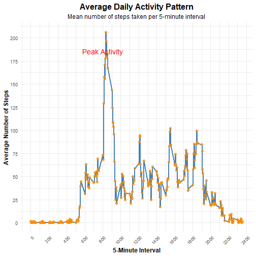

# 1 Descargar 

``` r
url <- "https://d396qusza40orc.cloudfront.net/repdata%2Fdata%2Factivity.zip"
download.file(url = url, destfile = "data/monitoring_data.zip")
```

```
## Warning in download.file(url = url, destfile = "data/monitoring_data.zip"): URL https://d396qusza40orc.cloudfront.net/repdata%2Fdata%2Factivity.zip: cannot
## open destfile 'data/monitoring_data.zip', reason 'No such file or directory'
```

```
## Warning in download.file(url = url, destfile = "data/monitoring_data.zip"): download had nonzero exit status
```

``` r
# Descomprimir 
unzip(zipfile = "data/monitoring_data.zip", exdir = "data/monitoring_data", overwrite = TRUE)
```

```
## Warning in unzip(zipfile = "data/monitoring_data.zip", exdir = "data/monitoring_data", : error 1 al extraer del archivo zip
```

# 2 Cargar #### 

``` r
if (!require("pacman")) {
  install.packages("pacman")
}
```

```
## Loading required package: pacman
```

```
## Warning: package 'pacman' was built under R version 4.3.3
```

``` r
pacman::p_load(dplyr, tidyverse, ggplot2, gtsummary, knitr, kableExtra) 

activity_data <- read.csv("data/monitoring_data/activity.csv")
```

```
## Warning in file(file, "rt"): no fue posible abrir el archivo 'data/monitoring_data/activity.csv': No such file or directory
```

```
## Error in file(file, "rt"): no se puede abrir la conexión
```


# Pregunta 1 
# What is mean total number of steps taken per day?

``` r
## Datos
totales <- activity_data %>% 
  group_by(date) %>% 
  summarise(Totales = sum(steps), .groups = 'drop') %>%
  ungroup()
```


``` r
## Grafico
ggplot(totales, aes(x = Totales)) +
  geom_histogram(binwidth = 1000, fill = "blue", color = "black") +   
  labs(title = "Histogram of Total Steps per Day",
       x = "Total Steps",
       y = "Frequency") +
  theme_minimal()
```

```
## Warning: Removed 8 rows containing non-finite outside the scale range (`stat_bin()`).
```


``` r
## Media y Promedio
summary_table_totales <- totales %>%
  tbl_summary(
    include = Totales,  
    statistic = list(all_continuous() ~ "{mean} ({median})"),   
    digits = list(Totales ~ 2)   
  ) %>%
  modify_header(label = "**Variable**", stat_0 = "**Summary**") %>%   
  bold_labels() 

summary_table_totales
```

<!--html_preserve--><div id="usmbngnrir" style="padding-left:0px;padding-right:0px;padding-top:10px;padding-bottom:10px;overflow-x:auto;overflow-y:auto;width:auto;height:auto;">
<style>#usmbngnrir table {
  font-family: system-ui, 'Segoe UI', Roboto, Helvetica, Arial, sans-serif, 'Apple Color Emoji', 'Segoe UI Emoji', 'Segoe UI Symbol', 'Noto Color Emoji';
  -webkit-font-smoothing: antialiased;
  -moz-osx-font-smoothing: grayscale;
}

#usmbngnrir thead, #usmbngnrir tbody, #usmbngnrir tfoot, #usmbngnrir tr, #usmbngnrir td, #usmbngnrir th {
  border-style: none;
}

#usmbngnrir p {
  margin: 0;
  padding: 0;
}

#usmbngnrir .gt_table {
  display: table;
  border-collapse: collapse;
  line-height: normal;
  margin-left: auto;
  margin-right: auto;
  color: #333333;
  font-size: 16px;
  font-weight: normal;
  font-style: normal;
  background-color: #FFFFFF;
  width: auto;
  border-top-style: solid;
  border-top-width: 2px;
  border-top-color: #A8A8A8;
  border-right-style: none;
  border-right-width: 2px;
  border-right-color: #D3D3D3;
  border-bottom-style: solid;
  border-bottom-width: 2px;
  border-bottom-color: #A8A8A8;
  border-left-style: none;
  border-left-width: 2px;
  border-left-color: #D3D3D3;
}

#usmbngnrir .gt_caption {
  padding-top: 4px;
  padding-bottom: 4px;
}

#usmbngnrir .gt_title {
  color: #333333;
  font-size: 125%;
  font-weight: initial;
  padding-top: 4px;
  padding-bottom: 4px;
  padding-left: 5px;
  padding-right: 5px;
  border-bottom-color: #FFFFFF;
  border-bottom-width: 0;
}

#usmbngnrir .gt_subtitle {
  color: #333333;
  font-size: 85%;
  font-weight: initial;
  padding-top: 3px;
  padding-bottom: 5px;
  padding-left: 5px;
  padding-right: 5px;
  border-top-color: #FFFFFF;
  border-top-width: 0;
}

#usmbngnrir .gt_heading {
  background-color: #FFFFFF;
  text-align: center;
  border-bottom-color: #FFFFFF;
  border-left-style: none;
  border-left-width: 1px;
  border-left-color: #D3D3D3;
  border-right-style: none;
  border-right-width: 1px;
  border-right-color: #D3D3D3;
}

#usmbngnrir .gt_bottom_border {
  border-bottom-style: solid;
  border-bottom-width: 2px;
  border-bottom-color: #D3D3D3;
}

#usmbngnrir .gt_col_headings {
  border-top-style: solid;
  border-top-width: 2px;
  border-top-color: #D3D3D3;
  border-bottom-style: solid;
  border-bottom-width: 2px;
  border-bottom-color: #D3D3D3;
  border-left-style: none;
  border-left-width: 1px;
  border-left-color: #D3D3D3;
  border-right-style: none;
  border-right-width: 1px;
  border-right-color: #D3D3D3;
}

#usmbngnrir .gt_col_heading {
  color: #333333;
  background-color: #FFFFFF;
  font-size: 100%;
  font-weight: normal;
  text-transform: inherit;
  border-left-style: none;
  border-left-width: 1px;
  border-left-color: #D3D3D3;
  border-right-style: none;
  border-right-width: 1px;
  border-right-color: #D3D3D3;
  vertical-align: bottom;
  padding-top: 5px;
  padding-bottom: 6px;
  padding-left: 5px;
  padding-right: 5px;
  overflow-x: hidden;
}

#usmbngnrir .gt_column_spanner_outer {
  color: #333333;
  background-color: #FFFFFF;
  font-size: 100%;
  font-weight: normal;
  text-transform: inherit;
  padding-top: 0;
  padding-bottom: 0;
  padding-left: 4px;
  padding-right: 4px;
}

#usmbngnrir .gt_column_spanner_outer:first-child {
  padding-left: 0;
}

#usmbngnrir .gt_column_spanner_outer:last-child {
  padding-right: 0;
}

#usmbngnrir .gt_column_spanner {
  border-bottom-style: solid;
  border-bottom-width: 2px;
  border-bottom-color: #D3D3D3;
  vertical-align: bottom;
  padding-top: 5px;
  padding-bottom: 5px;
  overflow-x: hidden;
  display: inline-block;
  width: 100%;
}

#usmbngnrir .gt_spanner_row {
  border-bottom-style: hidden;
}

#usmbngnrir .gt_group_heading {
  padding-top: 8px;
  padding-bottom: 8px;
  padding-left: 5px;
  padding-right: 5px;
  color: #333333;
  background-color: #FFFFFF;
  font-size: 100%;
  font-weight: initial;
  text-transform: inherit;
  border-top-style: solid;
  border-top-width: 2px;
  border-top-color: #D3D3D3;
  border-bottom-style: solid;
  border-bottom-width: 2px;
  border-bottom-color: #D3D3D3;
  border-left-style: none;
  border-left-width: 1px;
  border-left-color: #D3D3D3;
  border-right-style: none;
  border-right-width: 1px;
  border-right-color: #D3D3D3;
  vertical-align: middle;
  text-align: left;
}

#usmbngnrir .gt_empty_group_heading {
  padding: 0.5px;
  color: #333333;
  background-color: #FFFFFF;
  font-size: 100%;
  font-weight: initial;
  border-top-style: solid;
  border-top-width: 2px;
  border-top-color: #D3D3D3;
  border-bottom-style: solid;
  border-bottom-width: 2px;
  border-bottom-color: #D3D3D3;
  vertical-align: middle;
}

#usmbngnrir .gt_from_md > :first-child {
  margin-top: 0;
}

#usmbngnrir .gt_from_md > :last-child {
  margin-bottom: 0;
}

#usmbngnrir .gt_row {
  padding-top: 8px;
  padding-bottom: 8px;
  padding-left: 5px;
  padding-right: 5px;
  margin: 10px;
  border-top-style: solid;
  border-top-width: 1px;
  border-top-color: #D3D3D3;
  border-left-style: none;
  border-left-width: 1px;
  border-left-color: #D3D3D3;
  border-right-style: none;
  border-right-width: 1px;
  border-right-color: #D3D3D3;
  vertical-align: middle;
  overflow-x: hidden;
}

#usmbngnrir .gt_stub {
  color: #333333;
  background-color: #FFFFFF;
  font-size: 100%;
  font-weight: initial;
  text-transform: inherit;
  border-right-style: solid;
  border-right-width: 2px;
  border-right-color: #D3D3D3;
  padding-left: 5px;
  padding-right: 5px;
}

#usmbngnrir .gt_stub_row_group {
  color: #333333;
  background-color: #FFFFFF;
  font-size: 100%;
  font-weight: initial;
  text-transform: inherit;
  border-right-style: solid;
  border-right-width: 2px;
  border-right-color: #D3D3D3;
  padding-left: 5px;
  padding-right: 5px;
  vertical-align: top;
}

#usmbngnrir .gt_row_group_first td {
  border-top-width: 2px;
}

#usmbngnrir .gt_row_group_first th {
  border-top-width: 2px;
}

#usmbngnrir .gt_summary_row {
  color: #333333;
  background-color: #FFFFFF;
  text-transform: inherit;
  padding-top: 8px;
  padding-bottom: 8px;
  padding-left: 5px;
  padding-right: 5px;
}

#usmbngnrir .gt_first_summary_row {
  border-top-style: solid;
  border-top-color: #D3D3D3;
}

#usmbngnrir .gt_first_summary_row.thick {
  border-top-width: 2px;
}

#usmbngnrir .gt_last_summary_row {
  padding-top: 8px;
  padding-bottom: 8px;
  padding-left: 5px;
  padding-right: 5px;
  border-bottom-style: solid;
  border-bottom-width: 2px;
  border-bottom-color: #D3D3D3;
}

#usmbngnrir .gt_grand_summary_row {
  color: #333333;
  background-color: #FFFFFF;
  text-transform: inherit;
  padding-top: 8px;
  padding-bottom: 8px;
  padding-left: 5px;
  padding-right: 5px;
}

#usmbngnrir .gt_first_grand_summary_row {
  padding-top: 8px;
  padding-bottom: 8px;
  padding-left: 5px;
  padding-right: 5px;
  border-top-style: double;
  border-top-width: 6px;
  border-top-color: #D3D3D3;
}

#usmbngnrir .gt_last_grand_summary_row_top {
  padding-top: 8px;
  padding-bottom: 8px;
  padding-left: 5px;
  padding-right: 5px;
  border-bottom-style: double;
  border-bottom-width: 6px;
  border-bottom-color: #D3D3D3;
}

#usmbngnrir .gt_striped {
  background-color: rgba(128, 128, 128, 0.05);
}

#usmbngnrir .gt_table_body {
  border-top-style: solid;
  border-top-width: 2px;
  border-top-color: #D3D3D3;
  border-bottom-style: solid;
  border-bottom-width: 2px;
  border-bottom-color: #D3D3D3;
}

#usmbngnrir .gt_footnotes {
  color: #333333;
  background-color: #FFFFFF;
  border-bottom-style: none;
  border-bottom-width: 2px;
  border-bottom-color: #D3D3D3;
  border-left-style: none;
  border-left-width: 2px;
  border-left-color: #D3D3D3;
  border-right-style: none;
  border-right-width: 2px;
  border-right-color: #D3D3D3;
}

#usmbngnrir .gt_footnote {
  margin: 0px;
  font-size: 90%;
  padding-top: 4px;
  padding-bottom: 4px;
  padding-left: 5px;
  padding-right: 5px;
}

#usmbngnrir .gt_sourcenotes {
  color: #333333;
  background-color: #FFFFFF;
  border-bottom-style: none;
  border-bottom-width: 2px;
  border-bottom-color: #D3D3D3;
  border-left-style: none;
  border-left-width: 2px;
  border-left-color: #D3D3D3;
  border-right-style: none;
  border-right-width: 2px;
  border-right-color: #D3D3D3;
}

#usmbngnrir .gt_sourcenote {
  font-size: 90%;
  padding-top: 4px;
  padding-bottom: 4px;
  padding-left: 5px;
  padding-right: 5px;
}

#usmbngnrir .gt_left {
  text-align: left;
}

#usmbngnrir .gt_center {
  text-align: center;
}

#usmbngnrir .gt_right {
  text-align: right;
  font-variant-numeric: tabular-nums;
}

#usmbngnrir .gt_font_normal {
  font-weight: normal;
}

#usmbngnrir .gt_font_bold {
  font-weight: bold;
}

#usmbngnrir .gt_font_italic {
  font-style: italic;
}

#usmbngnrir .gt_super {
  font-size: 65%;
}

#usmbngnrir .gt_footnote_marks {
  font-size: 75%;
  vertical-align: 0.4em;
  position: initial;
}

#usmbngnrir .gt_asterisk {
  font-size: 100%;
  vertical-align: 0;
}

#usmbngnrir .gt_indent_1 {
  text-indent: 5px;
}

#usmbngnrir .gt_indent_2 {
  text-indent: 10px;
}

#usmbngnrir .gt_indent_3 {
  text-indent: 15px;
}

#usmbngnrir .gt_indent_4 {
  text-indent: 20px;
}

#usmbngnrir .gt_indent_5 {
  text-indent: 25px;
}

#usmbngnrir .katex-display {
  display: inline-flex !important;
  margin-bottom: 0.75em !important;
}

#usmbngnrir div.Reactable > div.rt-table > div.rt-thead > div.rt-tr.rt-tr-group-header > div.rt-th-group:after {
  height: 0px !important;
}
</style>
<table class="gt_table" data-quarto-disable-processing="false" data-quarto-bootstrap="false">
  <thead>
    <tr class="gt_col_headings">
      <th class="gt_col_heading gt_columns_bottom_border gt_left" rowspan="1" colspan="1" scope="col" id="label"><span class='gt_from_md'><strong>Variable</strong></span></th>
      <th class="gt_col_heading gt_columns_bottom_border gt_center" rowspan="1" colspan="1" scope="col" id="stat_0"><span class='gt_from_md'><strong>Summary</strong></span><span class="gt_footnote_marks" style="white-space:nowrap;font-style:italic;font-weight:normal;line-height:0;"><sup>1</sup></span></th>
    </tr>
  </thead>
  <tbody class="gt_table_body">
    <tr><td headers="label" class="gt_row gt_left" style="font-weight: bold;">Totales</td>
<td headers="stat_0" class="gt_row gt_center">10,766.19 (10,765.00)</td></tr>
    <tr><td headers="label" class="gt_row gt_left">    Unknown</td>
<td headers="stat_0" class="gt_row gt_center">8</td></tr>
  </tbody>
  
  <tfoot class="gt_footnotes">
    <tr>
      <td class="gt_footnote" colspan="2"><span class="gt_footnote_marks" style="white-space:nowrap;font-style:italic;font-weight:normal;line-height:0;"><sup>1</sup></span> <span class='gt_from_md'>Mean (Median)</span></td>
    </tr>
  </tfoot>
</table>
</div><!--/html_preserve-->

# Pregunta 2 ####
# What is the average daily activity pattern?

``` r
## Datos 
activity_pattern <- activity_data %>% 
  na.omit() %>% 
  group_by(interval) %>% 
  summarise(mean = mean(steps))
```


``` r
ggplot(activity_pattern, aes(x = interval, y = mean)) +
  geom_line(color = "steelblue", size = 1) +  
  geom_point(color = "darkorange", size = 2, alpha = 0.6) +  
  labs(
    title = "Average Daily Activity Pattern", 
    subtitle = "Mean number of steps taken per 5-minute interval",  
    x = "5-Minute Interval",  
    y = "Average Number of Steps"  
  ) +
  theme_minimal() +  
  theme(
    plot.title = element_text(size = 16, face = "bold", hjust = 0.5),   
    plot.subtitle = element_text(size = 12, hjust = 0.5),   
    axis.title.x = element_text(size = 12, face = "bold"),   
    axis.title.y = element_text(size = 12, face = "bold"),   
    axis.text.x = element_text(angle = 45, hjust = 1)   
  ) +
  scale_x_continuous(breaks = seq(0, 2400, by = 200)) +   
  scale_y_continuous(breaks = seq(0, max(activity_pattern$mean, na.rm = TRUE), by = 25)) +   
  annotate("text", x = 800, y = max(activity_pattern$mean, na.rm = TRUE) * 0.9, 
           label = "Peak Activity", color = "red", size = 5)   
```

```
## Warning: Using `size` aesthetic for lines was deprecated in ggplot2 3.4.0.
## ℹ Please use `linewidth` instead.
## This warning is displayed once every 8 hours.
## Call `lifecycle::last_lifecycle_warnings()` to see where this warning was generated.
```




``` r
## Datos
max_mean_row <- activity_pattern %>%
  filter(mean == max(mean, na.rm = TRUE))

# Create a summary table
summary_table <- activity_pattern %>%
  tbl_summary(
    include = mean,  
    statistic = list(all_continuous() ~ "{max}"),   
    digits = list(mean ~ 2) 
  ) %>%
  modify_header(label = "**Variable**", stat_0 = "**Summary**") %>%   
  bold_labels() 

# Add a row for the interval corresponding to the maximum mean value
summary_table <- summary_table %>%
  modify_table_body(
    ~ .x %>%
      add_row(
        variable = "Interval with Max Mean",
        label = "Interval",
        stat_0 = as.character(max_mean_row$interval)  # Convert interval to character
      )
  )

# Print the summary table
summary_table
```

<!--html_preserve--><div id="jgplmzkpkf" style="padding-left:0px;padding-right:0px;padding-top:10px;padding-bottom:10px;overflow-x:auto;overflow-y:auto;width:auto;height:auto;">
<style>#jgplmzkpkf table {
  font-family: system-ui, 'Segoe UI', Roboto, Helvetica, Arial, sans-serif, 'Apple Color Emoji', 'Segoe UI Emoji', 'Segoe UI Symbol', 'Noto Color Emoji';
  -webkit-font-smoothing: antialiased;
  -moz-osx-font-smoothing: grayscale;
}

#jgplmzkpkf thead, #jgplmzkpkf tbody, #jgplmzkpkf tfoot, #jgplmzkpkf tr, #jgplmzkpkf td, #jgplmzkpkf th {
  border-style: none;
}

#jgplmzkpkf p {
  margin: 0;
  padding: 0;
}

#jgplmzkpkf .gt_table {
  display: table;
  border-collapse: collapse;
  line-height: normal;
  margin-left: auto;
  margin-right: auto;
  color: #333333;
  font-size: 16px;
  font-weight: normal;
  font-style: normal;
  background-color: #FFFFFF;
  width: auto;
  border-top-style: solid;
  border-top-width: 2px;
  border-top-color: #A8A8A8;
  border-right-style: none;
  border-right-width: 2px;
  border-right-color: #D3D3D3;
  border-bottom-style: solid;
  border-bottom-width: 2px;
  border-bottom-color: #A8A8A8;
  border-left-style: none;
  border-left-width: 2px;
  border-left-color: #D3D3D3;
}

#jgplmzkpkf .gt_caption {
  padding-top: 4px;
  padding-bottom: 4px;
}

#jgplmzkpkf .gt_title {
  color: #333333;
  font-size: 125%;
  font-weight: initial;
  padding-top: 4px;
  padding-bottom: 4px;
  padding-left: 5px;
  padding-right: 5px;
  border-bottom-color: #FFFFFF;
  border-bottom-width: 0;
}

#jgplmzkpkf .gt_subtitle {
  color: #333333;
  font-size: 85%;
  font-weight: initial;
  padding-top: 3px;
  padding-bottom: 5px;
  padding-left: 5px;
  padding-right: 5px;
  border-top-color: #FFFFFF;
  border-top-width: 0;
}

#jgplmzkpkf .gt_heading {
  background-color: #FFFFFF;
  text-align: center;
  border-bottom-color: #FFFFFF;
  border-left-style: none;
  border-left-width: 1px;
  border-left-color: #D3D3D3;
  border-right-style: none;
  border-right-width: 1px;
  border-right-color: #D3D3D3;
}

#jgplmzkpkf .gt_bottom_border {
  border-bottom-style: solid;
  border-bottom-width: 2px;
  border-bottom-color: #D3D3D3;
}

#jgplmzkpkf .gt_col_headings {
  border-top-style: solid;
  border-top-width: 2px;
  border-top-color: #D3D3D3;
  border-bottom-style: solid;
  border-bottom-width: 2px;
  border-bottom-color: #D3D3D3;
  border-left-style: none;
  border-left-width: 1px;
  border-left-color: #D3D3D3;
  border-right-style: none;
  border-right-width: 1px;
  border-right-color: #D3D3D3;
}

#jgplmzkpkf .gt_col_heading {
  color: #333333;
  background-color: #FFFFFF;
  font-size: 100%;
  font-weight: normal;
  text-transform: inherit;
  border-left-style: none;
  border-left-width: 1px;
  border-left-color: #D3D3D3;
  border-right-style: none;
  border-right-width: 1px;
  border-right-color: #D3D3D3;
  vertical-align: bottom;
  padding-top: 5px;
  padding-bottom: 6px;
  padding-left: 5px;
  padding-right: 5px;
  overflow-x: hidden;
}

#jgplmzkpkf .gt_column_spanner_outer {
  color: #333333;
  background-color: #FFFFFF;
  font-size: 100%;
  font-weight: normal;
  text-transform: inherit;
  padding-top: 0;
  padding-bottom: 0;
  padding-left: 4px;
  padding-right: 4px;
}

#jgplmzkpkf .gt_column_spanner_outer:first-child {
  padding-left: 0;
}

#jgplmzkpkf .gt_column_spanner_outer:last-child {
  padding-right: 0;
}

#jgplmzkpkf .gt_column_spanner {
  border-bottom-style: solid;
  border-bottom-width: 2px;
  border-bottom-color: #D3D3D3;
  vertical-align: bottom;
  padding-top: 5px;
  padding-bottom: 5px;
  overflow-x: hidden;
  display: inline-block;
  width: 100%;
}

#jgplmzkpkf .gt_spanner_row {
  border-bottom-style: hidden;
}

#jgplmzkpkf .gt_group_heading {
  padding-top: 8px;
  padding-bottom: 8px;
  padding-left: 5px;
  padding-right: 5px;
  color: #333333;
  background-color: #FFFFFF;
  font-size: 100%;
  font-weight: initial;
  text-transform: inherit;
  border-top-style: solid;
  border-top-width: 2px;
  border-top-color: #D3D3D3;
  border-bottom-style: solid;
  border-bottom-width: 2px;
  border-bottom-color: #D3D3D3;
  border-left-style: none;
  border-left-width: 1px;
  border-left-color: #D3D3D3;
  border-right-style: none;
  border-right-width: 1px;
  border-right-color: #D3D3D3;
  vertical-align: middle;
  text-align: left;
}

#jgplmzkpkf .gt_empty_group_heading {
  padding: 0.5px;
  color: #333333;
  background-color: #FFFFFF;
  font-size: 100%;
  font-weight: initial;
  border-top-style: solid;
  border-top-width: 2px;
  border-top-color: #D3D3D3;
  border-bottom-style: solid;
  border-bottom-width: 2px;
  border-bottom-color: #D3D3D3;
  vertical-align: middle;
}

#jgplmzkpkf .gt_from_md > :first-child {
  margin-top: 0;
}

#jgplmzkpkf .gt_from_md > :last-child {
  margin-bottom: 0;
}

#jgplmzkpkf .gt_row {
  padding-top: 8px;
  padding-bottom: 8px;
  padding-left: 5px;
  padding-right: 5px;
  margin: 10px;
  border-top-style: solid;
  border-top-width: 1px;
  border-top-color: #D3D3D3;
  border-left-style: none;
  border-left-width: 1px;
  border-left-color: #D3D3D3;
  border-right-style: none;
  border-right-width: 1px;
  border-right-color: #D3D3D3;
  vertical-align: middle;
  overflow-x: hidden;
}

#jgplmzkpkf .gt_stub {
  color: #333333;
  background-color: #FFFFFF;
  font-size: 100%;
  font-weight: initial;
  text-transform: inherit;
  border-right-style: solid;
  border-right-width: 2px;
  border-right-color: #D3D3D3;
  padding-left: 5px;
  padding-right: 5px;
}

#jgplmzkpkf .gt_stub_row_group {
  color: #333333;
  background-color: #FFFFFF;
  font-size: 100%;
  font-weight: initial;
  text-transform: inherit;
  border-right-style: solid;
  border-right-width: 2px;
  border-right-color: #D3D3D3;
  padding-left: 5px;
  padding-right: 5px;
  vertical-align: top;
}

#jgplmzkpkf .gt_row_group_first td {
  border-top-width: 2px;
}

#jgplmzkpkf .gt_row_group_first th {
  border-top-width: 2px;
}

#jgplmzkpkf .gt_summary_row {
  color: #333333;
  background-color: #FFFFFF;
  text-transform: inherit;
  padding-top: 8px;
  padding-bottom: 8px;
  padding-left: 5px;
  padding-right: 5px;
}

#jgplmzkpkf .gt_first_summary_row {
  border-top-style: solid;
  border-top-color: #D3D3D3;
}

#jgplmzkpkf .gt_first_summary_row.thick {
  border-top-width: 2px;
}

#jgplmzkpkf .gt_last_summary_row {
  padding-top: 8px;
  padding-bottom: 8px;
  padding-left: 5px;
  padding-right: 5px;
  border-bottom-style: solid;
  border-bottom-width: 2px;
  border-bottom-color: #D3D3D3;
}

#jgplmzkpkf .gt_grand_summary_row {
  color: #333333;
  background-color: #FFFFFF;
  text-transform: inherit;
  padding-top: 8px;
  padding-bottom: 8px;
  padding-left: 5px;
  padding-right: 5px;
}

#jgplmzkpkf .gt_first_grand_summary_row {
  padding-top: 8px;
  padding-bottom: 8px;
  padding-left: 5px;
  padding-right: 5px;
  border-top-style: double;
  border-top-width: 6px;
  border-top-color: #D3D3D3;
}

#jgplmzkpkf .gt_last_grand_summary_row_top {
  padding-top: 8px;
  padding-bottom: 8px;
  padding-left: 5px;
  padding-right: 5px;
  border-bottom-style: double;
  border-bottom-width: 6px;
  border-bottom-color: #D3D3D3;
}

#jgplmzkpkf .gt_striped {
  background-color: rgba(128, 128, 128, 0.05);
}

#jgplmzkpkf .gt_table_body {
  border-top-style: solid;
  border-top-width: 2px;
  border-top-color: #D3D3D3;
  border-bottom-style: solid;
  border-bottom-width: 2px;
  border-bottom-color: #D3D3D3;
}

#jgplmzkpkf .gt_footnotes {
  color: #333333;
  background-color: #FFFFFF;
  border-bottom-style: none;
  border-bottom-width: 2px;
  border-bottom-color: #D3D3D3;
  border-left-style: none;
  border-left-width: 2px;
  border-left-color: #D3D3D3;
  border-right-style: none;
  border-right-width: 2px;
  border-right-color: #D3D3D3;
}

#jgplmzkpkf .gt_footnote {
  margin: 0px;
  font-size: 90%;
  padding-top: 4px;
  padding-bottom: 4px;
  padding-left: 5px;
  padding-right: 5px;
}

#jgplmzkpkf .gt_sourcenotes {
  color: #333333;
  background-color: #FFFFFF;
  border-bottom-style: none;
  border-bottom-width: 2px;
  border-bottom-color: #D3D3D3;
  border-left-style: none;
  border-left-width: 2px;
  border-left-color: #D3D3D3;
  border-right-style: none;
  border-right-width: 2px;
  border-right-color: #D3D3D3;
}

#jgplmzkpkf .gt_sourcenote {
  font-size: 90%;
  padding-top: 4px;
  padding-bottom: 4px;
  padding-left: 5px;
  padding-right: 5px;
}

#jgplmzkpkf .gt_left {
  text-align: left;
}

#jgplmzkpkf .gt_center {
  text-align: center;
}

#jgplmzkpkf .gt_right {
  text-align: right;
  font-variant-numeric: tabular-nums;
}

#jgplmzkpkf .gt_font_normal {
  font-weight: normal;
}

#jgplmzkpkf .gt_font_bold {
  font-weight: bold;
}

#jgplmzkpkf .gt_font_italic {
  font-style: italic;
}

#jgplmzkpkf .gt_super {
  font-size: 65%;
}

#jgplmzkpkf .gt_footnote_marks {
  font-size: 75%;
  vertical-align: 0.4em;
  position: initial;
}

#jgplmzkpkf .gt_asterisk {
  font-size: 100%;
  vertical-align: 0;
}

#jgplmzkpkf .gt_indent_1 {
  text-indent: 5px;
}

#jgplmzkpkf .gt_indent_2 {
  text-indent: 10px;
}

#jgplmzkpkf .gt_indent_3 {
  text-indent: 15px;
}

#jgplmzkpkf .gt_indent_4 {
  text-indent: 20px;
}

#jgplmzkpkf .gt_indent_5 {
  text-indent: 25px;
}

#jgplmzkpkf .katex-display {
  display: inline-flex !important;
  margin-bottom: 0.75em !important;
}

#jgplmzkpkf div.Reactable > div.rt-table > div.rt-thead > div.rt-tr.rt-tr-group-header > div.rt-th-group:after {
  height: 0px !important;
}
</style>
<table class="gt_table" data-quarto-disable-processing="false" data-quarto-bootstrap="false">
  <thead>
    <tr class="gt_col_headings">
      <th class="gt_col_heading gt_columns_bottom_border gt_left" rowspan="1" colspan="1" scope="col" id="label"><span class='gt_from_md'><strong>Variable</strong></span></th>
      <th class="gt_col_heading gt_columns_bottom_border gt_center" rowspan="1" colspan="1" scope="col" id="stat_0"><span class='gt_from_md'><strong>Summary</strong></span><span class="gt_footnote_marks" style="white-space:nowrap;font-style:italic;font-weight:normal;line-height:0;"><sup>1</sup></span></th>
    </tr>
  </thead>
  <tbody class="gt_table_body">
    <tr><td headers="label" class="gt_row gt_left" style="font-weight: bold;">mean</td>
<td headers="stat_0" class="gt_row gt_center">206.17</td></tr>
    <tr><td headers="label" class="gt_row gt_left">Interval</td>
<td headers="stat_0" class="gt_row gt_center">835</td></tr>
  </tbody>
  
  <tfoot class="gt_footnotes">
    <tr>
      <td class="gt_footnote" colspan="2"><span class="gt_footnote_marks" style="white-space:nowrap;font-style:italic;font-weight:normal;line-height:0;"><sup>1</sup></span> <span class='gt_from_md'>Max</span></td>
    </tr>
  </tfoot>
</table>
</div><!--/html_preserve-->
 

# Pregunta 3 ####
## Imputing missing values

``` r
na_activity <- activity_data%>% 
  is.na() %>% 
  as.data.frame() %>% 
  summarise(na_steps = sum(steps), 
            na_dates = sum(date), 
            na_interval = sum(interval))

na_activity %>%
  kable(
    caption = "Summary of Missing Values (NA) in Activity Data",  # Add a caption
    col.names = c("NA in Steps", "NA in Dates", "NA in Intervals"),  # Rename columns
    align = "c"  # Center-align the table content
  ) %>%
  kable_styling(  # Add styling to the table
    bootstrap_options = c("striped", "hover", "condensed", "responsive"),
    full_width = FALSE,
    position = "center"
  )  
```

<table class="table table-striped table-hover table-condensed table-responsive" style="color: black; width: auto !important; margin-left: auto; margin-right: auto;">
<caption>Summary of Missing Values (NA) in Activity Data</caption>
 <thead>
  <tr>
   <th style="text-align:center;"> NA in Steps </th>
   <th style="text-align:center;"> NA in Dates </th>
   <th style="text-align:center;"> NA in Intervals </th>
  </tr>
 </thead>
<tbody>
  <tr>
   <td style="text-align:center;"> 2304 </td>
   <td style="text-align:center;"> 0 </td>
   <td style="text-align:center;"> 0 </td>
  </tr>
</tbody>
</table>


``` r
## Valores de NA
activity_data_filled <- activity_data %>%
  left_join(activity_pattern, by = "interval") %>%   
  mutate(steps = ifelse(is.na(steps), mean, steps)) %>% 
  select(-mean)  # Eliminar la columna temporal "mean"

## totales na corregido
totales_na <- activity_data_filled %>% 
  group_by(date) %>% 
  summarise(Totales = sum(steps), .groups = 'drop') %>%
  ungroup()
```


``` r
## Grafico
ggplot(totales_na, aes(x = Totales)) +
  geom_histogram(binwidth = 1000, fill = "blue", color = "black") +   
  labs(title = "Histogram of Total Steps per Day",
       x = "Total Steps",
       y = "Frequency") +
  theme_minimal()
```


``` r
## Media y Promedio
summary_table_na <- totales_na %>%
  tbl_summary(
    include = Totales,  
    statistic = list(all_continuous() ~ "{mean} ({median})"),   
    digits = list(Totales ~ 2)   
  ) %>%
  modify_header(label = "**Variable**", stat_0 = "**Summary**") %>%   
  bold_labels() 

summary_table_na
```

<!--html_preserve--><div id="gajugxgtcd" style="padding-left:0px;padding-right:0px;padding-top:10px;padding-bottom:10px;overflow-x:auto;overflow-y:auto;width:auto;height:auto;">
<style>#gajugxgtcd table {
  font-family: system-ui, 'Segoe UI', Roboto, Helvetica, Arial, sans-serif, 'Apple Color Emoji', 'Segoe UI Emoji', 'Segoe UI Symbol', 'Noto Color Emoji';
  -webkit-font-smoothing: antialiased;
  -moz-osx-font-smoothing: grayscale;
}

#gajugxgtcd thead, #gajugxgtcd tbody, #gajugxgtcd tfoot, #gajugxgtcd tr, #gajugxgtcd td, #gajugxgtcd th {
  border-style: none;
}

#gajugxgtcd p {
  margin: 0;
  padding: 0;
}

#gajugxgtcd .gt_table {
  display: table;
  border-collapse: collapse;
  line-height: normal;
  margin-left: auto;
  margin-right: auto;
  color: #333333;
  font-size: 16px;
  font-weight: normal;
  font-style: normal;
  background-color: #FFFFFF;
  width: auto;
  border-top-style: solid;
  border-top-width: 2px;
  border-top-color: #A8A8A8;
  border-right-style: none;
  border-right-width: 2px;
  border-right-color: #D3D3D3;
  border-bottom-style: solid;
  border-bottom-width: 2px;
  border-bottom-color: #A8A8A8;
  border-left-style: none;
  border-left-width: 2px;
  border-left-color: #D3D3D3;
}

#gajugxgtcd .gt_caption {
  padding-top: 4px;
  padding-bottom: 4px;
}

#gajugxgtcd .gt_title {
  color: #333333;
  font-size: 125%;
  font-weight: initial;
  padding-top: 4px;
  padding-bottom: 4px;
  padding-left: 5px;
  padding-right: 5px;
  border-bottom-color: #FFFFFF;
  border-bottom-width: 0;
}

#gajugxgtcd .gt_subtitle {
  color: #333333;
  font-size: 85%;
  font-weight: initial;
  padding-top: 3px;
  padding-bottom: 5px;
  padding-left: 5px;
  padding-right: 5px;
  border-top-color: #FFFFFF;
  border-top-width: 0;
}

#gajugxgtcd .gt_heading {
  background-color: #FFFFFF;
  text-align: center;
  border-bottom-color: #FFFFFF;
  border-left-style: none;
  border-left-width: 1px;
  border-left-color: #D3D3D3;
  border-right-style: none;
  border-right-width: 1px;
  border-right-color: #D3D3D3;
}

#gajugxgtcd .gt_bottom_border {
  border-bottom-style: solid;
  border-bottom-width: 2px;
  border-bottom-color: #D3D3D3;
}

#gajugxgtcd .gt_col_headings {
  border-top-style: solid;
  border-top-width: 2px;
  border-top-color: #D3D3D3;
  border-bottom-style: solid;
  border-bottom-width: 2px;
  border-bottom-color: #D3D3D3;
  border-left-style: none;
  border-left-width: 1px;
  border-left-color: #D3D3D3;
  border-right-style: none;
  border-right-width: 1px;
  border-right-color: #D3D3D3;
}

#gajugxgtcd .gt_col_heading {
  color: #333333;
  background-color: #FFFFFF;
  font-size: 100%;
  font-weight: normal;
  text-transform: inherit;
  border-left-style: none;
  border-left-width: 1px;
  border-left-color: #D3D3D3;
  border-right-style: none;
  border-right-width: 1px;
  border-right-color: #D3D3D3;
  vertical-align: bottom;
  padding-top: 5px;
  padding-bottom: 6px;
  padding-left: 5px;
  padding-right: 5px;
  overflow-x: hidden;
}

#gajugxgtcd .gt_column_spanner_outer {
  color: #333333;
  background-color: #FFFFFF;
  font-size: 100%;
  font-weight: normal;
  text-transform: inherit;
  padding-top: 0;
  padding-bottom: 0;
  padding-left: 4px;
  padding-right: 4px;
}

#gajugxgtcd .gt_column_spanner_outer:first-child {
  padding-left: 0;
}

#gajugxgtcd .gt_column_spanner_outer:last-child {
  padding-right: 0;
}

#gajugxgtcd .gt_column_spanner {
  border-bottom-style: solid;
  border-bottom-width: 2px;
  border-bottom-color: #D3D3D3;
  vertical-align: bottom;
  padding-top: 5px;
  padding-bottom: 5px;
  overflow-x: hidden;
  display: inline-block;
  width: 100%;
}

#gajugxgtcd .gt_spanner_row {
  border-bottom-style: hidden;
}

#gajugxgtcd .gt_group_heading {
  padding-top: 8px;
  padding-bottom: 8px;
  padding-left: 5px;
  padding-right: 5px;
  color: #333333;
  background-color: #FFFFFF;
  font-size: 100%;
  font-weight: initial;
  text-transform: inherit;
  border-top-style: solid;
  border-top-width: 2px;
  border-top-color: #D3D3D3;
  border-bottom-style: solid;
  border-bottom-width: 2px;
  border-bottom-color: #D3D3D3;
  border-left-style: none;
  border-left-width: 1px;
  border-left-color: #D3D3D3;
  border-right-style: none;
  border-right-width: 1px;
  border-right-color: #D3D3D3;
  vertical-align: middle;
  text-align: left;
}

#gajugxgtcd .gt_empty_group_heading {
  padding: 0.5px;
  color: #333333;
  background-color: #FFFFFF;
  font-size: 100%;
  font-weight: initial;
  border-top-style: solid;
  border-top-width: 2px;
  border-top-color: #D3D3D3;
  border-bottom-style: solid;
  border-bottom-width: 2px;
  border-bottom-color: #D3D3D3;
  vertical-align: middle;
}

#gajugxgtcd .gt_from_md > :first-child {
  margin-top: 0;
}

#gajugxgtcd .gt_from_md > :last-child {
  margin-bottom: 0;
}

#gajugxgtcd .gt_row {
  padding-top: 8px;
  padding-bottom: 8px;
  padding-left: 5px;
  padding-right: 5px;
  margin: 10px;
  border-top-style: solid;
  border-top-width: 1px;
  border-top-color: #D3D3D3;
  border-left-style: none;
  border-left-width: 1px;
  border-left-color: #D3D3D3;
  border-right-style: none;
  border-right-width: 1px;
  border-right-color: #D3D3D3;
  vertical-align: middle;
  overflow-x: hidden;
}

#gajugxgtcd .gt_stub {
  color: #333333;
  background-color: #FFFFFF;
  font-size: 100%;
  font-weight: initial;
  text-transform: inherit;
  border-right-style: solid;
  border-right-width: 2px;
  border-right-color: #D3D3D3;
  padding-left: 5px;
  padding-right: 5px;
}

#gajugxgtcd .gt_stub_row_group {
  color: #333333;
  background-color: #FFFFFF;
  font-size: 100%;
  font-weight: initial;
  text-transform: inherit;
  border-right-style: solid;
  border-right-width: 2px;
  border-right-color: #D3D3D3;
  padding-left: 5px;
  padding-right: 5px;
  vertical-align: top;
}

#gajugxgtcd .gt_row_group_first td {
  border-top-width: 2px;
}

#gajugxgtcd .gt_row_group_first th {
  border-top-width: 2px;
}

#gajugxgtcd .gt_summary_row {
  color: #333333;
  background-color: #FFFFFF;
  text-transform: inherit;
  padding-top: 8px;
  padding-bottom: 8px;
  padding-left: 5px;
  padding-right: 5px;
}

#gajugxgtcd .gt_first_summary_row {
  border-top-style: solid;
  border-top-color: #D3D3D3;
}

#gajugxgtcd .gt_first_summary_row.thick {
  border-top-width: 2px;
}

#gajugxgtcd .gt_last_summary_row {
  padding-top: 8px;
  padding-bottom: 8px;
  padding-left: 5px;
  padding-right: 5px;
  border-bottom-style: solid;
  border-bottom-width: 2px;
  border-bottom-color: #D3D3D3;
}

#gajugxgtcd .gt_grand_summary_row {
  color: #333333;
  background-color: #FFFFFF;
  text-transform: inherit;
  padding-top: 8px;
  padding-bottom: 8px;
  padding-left: 5px;
  padding-right: 5px;
}

#gajugxgtcd .gt_first_grand_summary_row {
  padding-top: 8px;
  padding-bottom: 8px;
  padding-left: 5px;
  padding-right: 5px;
  border-top-style: double;
  border-top-width: 6px;
  border-top-color: #D3D3D3;
}

#gajugxgtcd .gt_last_grand_summary_row_top {
  padding-top: 8px;
  padding-bottom: 8px;
  padding-left: 5px;
  padding-right: 5px;
  border-bottom-style: double;
  border-bottom-width: 6px;
  border-bottom-color: #D3D3D3;
}

#gajugxgtcd .gt_striped {
  background-color: rgba(128, 128, 128, 0.05);
}

#gajugxgtcd .gt_table_body {
  border-top-style: solid;
  border-top-width: 2px;
  border-top-color: #D3D3D3;
  border-bottom-style: solid;
  border-bottom-width: 2px;
  border-bottom-color: #D3D3D3;
}

#gajugxgtcd .gt_footnotes {
  color: #333333;
  background-color: #FFFFFF;
  border-bottom-style: none;
  border-bottom-width: 2px;
  border-bottom-color: #D3D3D3;
  border-left-style: none;
  border-left-width: 2px;
  border-left-color: #D3D3D3;
  border-right-style: none;
  border-right-width: 2px;
  border-right-color: #D3D3D3;
}

#gajugxgtcd .gt_footnote {
  margin: 0px;
  font-size: 90%;
  padding-top: 4px;
  padding-bottom: 4px;
  padding-left: 5px;
  padding-right: 5px;
}

#gajugxgtcd .gt_sourcenotes {
  color: #333333;
  background-color: #FFFFFF;
  border-bottom-style: none;
  border-bottom-width: 2px;
  border-bottom-color: #D3D3D3;
  border-left-style: none;
  border-left-width: 2px;
  border-left-color: #D3D3D3;
  border-right-style: none;
  border-right-width: 2px;
  border-right-color: #D3D3D3;
}

#gajugxgtcd .gt_sourcenote {
  font-size: 90%;
  padding-top: 4px;
  padding-bottom: 4px;
  padding-left: 5px;
  padding-right: 5px;
}

#gajugxgtcd .gt_left {
  text-align: left;
}

#gajugxgtcd .gt_center {
  text-align: center;
}

#gajugxgtcd .gt_right {
  text-align: right;
  font-variant-numeric: tabular-nums;
}

#gajugxgtcd .gt_font_normal {
  font-weight: normal;
}

#gajugxgtcd .gt_font_bold {
  font-weight: bold;
}

#gajugxgtcd .gt_font_italic {
  font-style: italic;
}

#gajugxgtcd .gt_super {
  font-size: 65%;
}

#gajugxgtcd .gt_footnote_marks {
  font-size: 75%;
  vertical-align: 0.4em;
  position: initial;
}

#gajugxgtcd .gt_asterisk {
  font-size: 100%;
  vertical-align: 0;
}

#gajugxgtcd .gt_indent_1 {
  text-indent: 5px;
}

#gajugxgtcd .gt_indent_2 {
  text-indent: 10px;
}

#gajugxgtcd .gt_indent_3 {
  text-indent: 15px;
}

#gajugxgtcd .gt_indent_4 {
  text-indent: 20px;
}

#gajugxgtcd .gt_indent_5 {
  text-indent: 25px;
}

#gajugxgtcd .katex-display {
  display: inline-flex !important;
  margin-bottom: 0.75em !important;
}

#gajugxgtcd div.Reactable > div.rt-table > div.rt-thead > div.rt-tr.rt-tr-group-header > div.rt-th-group:after {
  height: 0px !important;
}
</style>
<table class="gt_table" data-quarto-disable-processing="false" data-quarto-bootstrap="false">
  <thead>
    <tr class="gt_col_headings">
      <th class="gt_col_heading gt_columns_bottom_border gt_left" rowspan="1" colspan="1" scope="col" id="label"><span class='gt_from_md'><strong>Variable</strong></span></th>
      <th class="gt_col_heading gt_columns_bottom_border gt_center" rowspan="1" colspan="1" scope="col" id="stat_0"><span class='gt_from_md'><strong>Summary</strong></span><span class="gt_footnote_marks" style="white-space:nowrap;font-style:italic;font-weight:normal;line-height:0;"><sup>1</sup></span></th>
    </tr>
  </thead>
  <tbody class="gt_table_body">
    <tr><td headers="label" class="gt_row gt_left" style="font-weight: bold;">Totales</td>
<td headers="stat_0" class="gt_row gt_center">10,766.19 (10,766.19)</td></tr>
  </tbody>
  
  <tfoot class="gt_footnotes">
    <tr>
      <td class="gt_footnote" colspan="2"><span class="gt_footnote_marks" style="white-space:nowrap;font-style:italic;font-weight:normal;line-height:0;"><sup>1</sup></span> <span class='gt_from_md'>Mean (Median)</span></td>
    </tr>
  </tfoot>
</table>
</div><!--/html_preserve-->


# Pregunta 4 ####
## Are there differences in activity patterns between weekdays and weekends?

``` r
## Datos
dias <- activity_data_filled %>%
  mutate(Type = factor(
    case_when(
      wday(date) %in% c(1, 7) ~ "Weekend",   
      TRUE ~ "Weekday" 
    ),
    levels = c("Weekday", "Weekend") 
  ))
```


``` r
## Grafico

dias %>%
  group_by(interval, Type) %>%
  summarise(mi = mean(steps, na.rm = TRUE)) %>%  
  ggplot(aes(x = interval, y = mi, color = Type)) +  
  geom_line(linewidth = 1) +  
  labs(
    x = "Interval",
    y = "Average Number of Steps",
    title = "Average Steps per Interval by Day Type",
    color = "Day Type"   
  ) +
  facet_grid(Type ~ ., scales = "free_y") + 
  theme_minimal() +  
  theme(
    strip.text = element_text(size = 12, face = "bold"), 
    legend.position = "bottom"  
  )
```

```
## `summarise()` has grouped output by 'interval'. You can override using the `.groups` argument.
```


